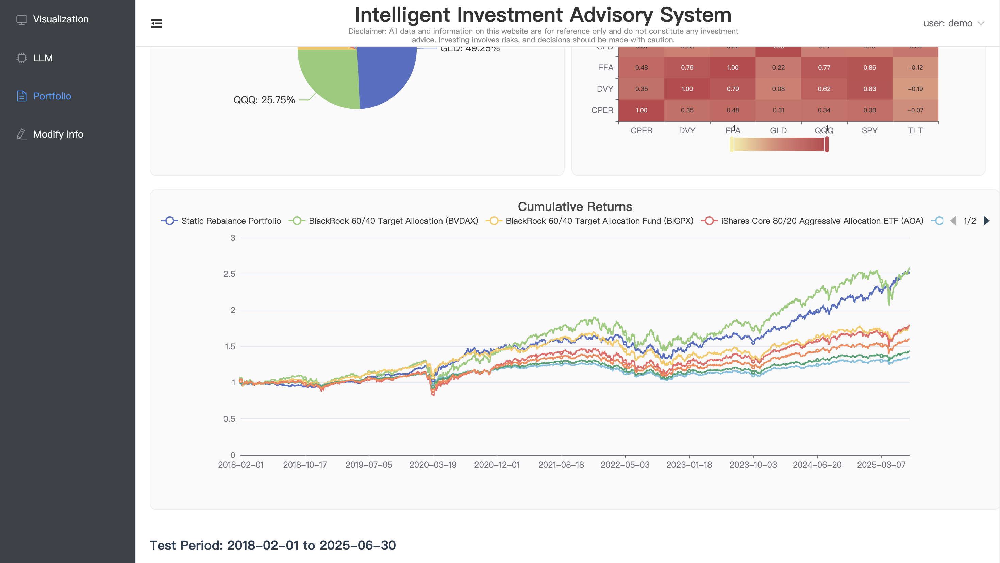

# Project Setup Guide

This project consists of a frontend (Vue) and backend (FastAPI). Please ensure you have the following installed on your
system:

- [Node.js](https://nodejs.org/) (Recommended: v16 or later)
- [Python](https://www.python.org/) (Recommended with Conda for environment management)
- [Conda](https://docs.conda.io/en/latest/miniconda.html)

---

## 🔧 Backend Setup

1. **Navigate to the backend project directory**:

```bash
cd backend
```

2. **Create and activate a Conda virtual environment**:

```bash
conda create -n platform_env python=3.10.16
conda activate platform_env
```

3. **Install required Python packages**:

```bash
pip install -r requirements.txt
```

4. **Start the backend service**:

```bash
cd app
uvicorn app.main:app --host=0.0.0.0 --port 8000
```

The backend service will start at `http://127.0.0.1:8000`.
The API documentation can be accessed at `http://127.0.0.1:8000/docs`.

---

## 🖥️ Frontend Setup

1. **Navigate to the frontend project directory**:

```bash
cd frontend
```

2. **Install Node dependencies**:

```bash
npm install
```

3. **Set Node.js options** (to fix OpenSSL compatibility issues):

```bash
export NODE_OPTIONS=--openssl-legacy-provider  # macOS / Linux
```

> For Windows users:

```bash
set NODE_OPTIONS=--openssl-legacy-provider
```

4. **Run the frontend service**:

```bash
npm run serve
```

The frontend service will run at `http://localhost:8080`.

---

## 📌 Notes

- Ensure the backend service is running before starting the frontend to avoid API errors.
- On Windows PowerShell, use `$env:NODE_OPTIONS="--openssl-legacy-provider"` instead of `export`.

---

## 🖼️ Project Screenshots

### 📈 Prediction Chart


### 📊 LLM Conversation


### 📈 Portfolio





